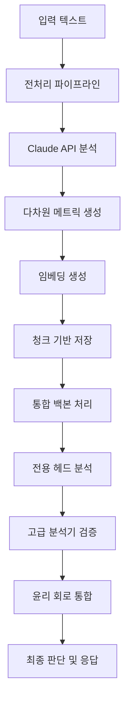

# Red Heart AI: 정서적 취약계층을 위한 객관적 윤리 판단 AI 시스템 - 전체 아키텍처

## Abstract

Red Heart AI는 정서적 취약계층을 위한 AI 할루시네이션 방지 및 객관적 윤리 판단을 목표로 개발된 800M 파라미터 통합 AI 시스템이다. 본 시스템은 Small Language Model(SLM) 기반의 직접적 계산 방식을 통해 정량적이고 객관적인 윤리 판단 및 감정 인식 기능을 제공한다. 300M 파라미터 공유 백본과 500M 파라미터 전용 헤드 구조를 통해 효율성과 전문성을 동시에 확보하였으며, 8개 윤리학파 통합 시스템, 다차원 감정 분석, 반사실적 후회 추론, 그리고 SURD 기반 인과분석을 통합한 종합적 AI 보호 시스템을 구축하였다.

## 1. 서론

### 1.1 연구 배景과 필요성

현대 AI 시스템의 발전과 함께 AI 할루시네이션(AI Hallucination) 문제가 심각한 사회적 이슈로 대두되고 있다. 특히 정서적으로 취약한 계층에게는 잘못된 AI 응답이 심리적 상처나 부적절한 의사결정으로 이어질 수 있어 더욱 신중한 접근이 필요하다. 기존의 Large Language Model(LLM) 기반 시스템들은 확률적 생성 방식의 특성상 불확실성이 높고, 윤리적 판단에서 일관성을 보장하기 어려운 한계가 있다.

### 1.2 연구 목표

본 연구는 다음과 같은 목표를 달성하고자 한다:

1. **객관적 윤리 판단**: 다양한 윤리학파를 통합한 정량적 윤리 평가 시스템 구축
2. **감정 인식 및 보호**: 정서적 취약계층의 감정 상태를 정확히 파악하고 보호하는 시스템
3. **할루시네이션 방지**: 다중 검증 메커니즘을 통한 AI 응답의 신뢰성 보장
4. **직접적 계산 방식**: SLM 기반의 명시적이고 투명한 계산 프로세스 구현

## 2. 전체 시스템 아키텍처

### 2.1 시스템 설계 철학

Red Heart AI 시스템은 다음의 핵심 설계 원칙을 기반으로 구축되었다:

#### 2.1.1 유기적 시너지 창출
- 각 모듈 간 Cross-Attention 메커니즘을 통한 정보 교환
- 감정-윤리-후회 삼각 회로를 통한 인간적 판단 프로세스 모델링
- 모듈 간 상호 검증 및 보완 시스템

#### 2.1.2 동적 메모리 관리
- LLM 스타일 RAM 스왑 메모리 관리 시스템
- 우선순위 기반 모델 로딩 및 언로딩
- GPU 메모리 효율성 최적화

#### 2.1.3 투명성과 해석가능성
- 각 판단 단계의 명시적 계산 과정 제공
- XAI(eXplainable AI) 기반 의사결정 과정 시각화
- 불확실성 정량화 및 신뢰도 측정

### 2.2 전체 아키텍처 구조

Red Heart AI는 800M 파라미터로 구성된 대규모 통합 시스템으로, 다음과 같은 계층적 구조를 갖는다:

```
┌─────────────────────────────────────────────────────────────┐
│                    입력 데이터 처리 계층                        │
├─────────────────────────────────────────────────────────────┤
│                   통합 백본 네트워크 (300M)                     │
│              • 공유 표현 학습                                │
│              • 메모리 뱅크 관리                              │
│              • Cross-Modal 정보 융합                        │
├─────────────────────────────────────────────────────────────┤
│                  전용 헤드 시스템 (500M)                       │
│    ┌───────────┬───────────┬───────────┬───────────┐        │
│    │감정 헤드   │벤담 헤드   │후회 헤드   │SURD 헤드  │        │
│    │(130M)    │(120M)    │(140M)    │(110M)    │        │
│    └───────────┴───────────┴───────────┴───────────┘        │
├─────────────────────────────────────────────────────────────┤
│                   고급 분석 모듈 계층                          │
│    ┌─────────────────────────────────────────────────────┐    │
│    │ 감정 분석기 │ 벤담 계산기 │ 후회 분석기 │ SURD 분석기 │    │
│    │    (MoE)   │  (신경망)   │   (LSTM)   │   (GNN)    │    │
│    └─────────────────────────────────────────────────────┘    │
├─────────────────────────────────────────────────────────────┤
│                감정-윤리-후회 삼각 회로                         │
│            • 다차원 윤리 통합 판단                            │
│            • 이해관계자 균형 고려                             │
│            • 문화적 맥락 인식                                │
└─────────────────────────────────────────────────────────────┘
```

### 2.3 핵심 구성 요소

#### 2.3.1 통합 백본 네트워크 (Unified Backbone)
- **파라미터 수**: 300M (전체의 37.5%)
- **주요 기능**:
  - 모든 태스크에 공통으로 사용되는 표현 학습
  - 메모리 뱅크를 통한 과거 경험 저장 및 활용
  - Cross-Modal 정보 융합 및 전역 컨텍스트 관리
- **아키텍처**: Transformer 기반 (d_model=896, 16 heads, 6 layers)

#### 2.3.2 전용 헤드 시스템 (Specialized Heads)
- **총 파라미터 수**: 500M (전체의 62.5%)
- **구성 요소**:
  - **감정 헤드** (130M): 7개 기본 감정 + 문화적 감정 처리
  - **벤담 헤드** (120M): 공리주의 기반 윤리 점수 계산
  - **후회 헤드** (140M): 반사실적 추론 및 미래 예측
  - **SURD 헤드** (110M): 정보이론 기반 인과분석

#### 2.3.3 고급 분석 모듈
각 헤드에 대응하는 전문 분석기들이 정교한 계산을 수행:
- **신경망 기반 전문가 시스템**: 각 도메인별 특화된 처리
- **앙상블 검증**: 다중 모델을 통한 결과 검증
- **불확실성 정량화**: 각 판단의 신뢰도 측정

## 3. 시스템 워크플로우

### 3.1 데이터 처리 파이프라인



### 3.2 실시간 처리 과정

1. **입력 분석**: 텍스트의 감정적, 윤리적 맥락 파악
2. **백본 처리**: 공통 표현 학습 및 메모리 뱅크 조회
3. **병렬 헤드 처리**: 각 전용 헤드에서 동시에 분석 수행
4. **고급 분석**: 전문 분석기들의 심층 검증
5. **통합 판단**: 감정-윤리-후회 삼각 회로를 통한 최종 결정
6. **신뢰도 평가**: 불확실성 정량화 및 신뢰도 측정
7. **응답 생성**: 안전하고 윤리적인 최종 응답 생성

### 3.3 메모리 관리 전략

#### 3.3.1 동적 GPU 관리
```python
# 핵심 메모리 관리 전략
class DynamicGPUManager:
    def __init__(self):
        self.memory_threshold = 0.85  # 85% 사용시 최적화
        self.priority_queue = []      # 모듈 우선순위
        
    def optimize_memory(self):
        if self.get_gpu_usage() > self.memory_threshold:
            self.swap_low_priority_modules()
            self.clear_cache()
```

#### 3.3.2 청크 기반 처리
- 대용량 데이터를 1000개 단위 청크로 분할
- 메모리 효율성과 처리 속도 최적화
- 실패 시 청크 단위 재처리 가능

## 4. 혁신적 특징

### 4.1 다차원 윤리 통합 시스템

Red Heart AI의 가장 큰 특징 중 하나는 8개 주요 윤리학파를 통합한 종합적 윤리 판단 시스템이다:

1. **공리주의**: 최대 행복 원칙 기반 결과 평가
2. **덕윤리학**: 인격과 덕목 중심의 판단
3. **의무론적 윤리**: 도덕적 의무와 규칙 준수
4. **돌봄 윤리**: 관계와 책임 중심의 접근
5. **정의론**: 공정성과 권리 보장
6. **서사 윤리**: 개인과 공동체의 이야기 맥락
7. **페미니스트 윤리**: 성별과 권력 관계 고려
8. **환경 윤리**: 생태계와 지속가능성 고려

### 4.2 감정-윤리-후회 삼각 회로

인간의 실제 의사결정 과정을 모델링한 혁신적 시스템:

```python
class EmotionEthicsRegretCircuit:
    def __init__(self):
        self.emotion_priority = ["community", "others", "self"]
        self.ethics_weight = 0.4
        self.emotion_weight = 0.4
        self.regret_weight = 0.2  # 미묘한 편향으로 작용
        
    def integrate_judgment(self, emotion, ethics, regret):
        # 공동체 감정을 최우선으로 고려
        # 슬픔과 같은 부정적 감정을 기쁨보다 우선시
        # 후회는 학습 메커니즘으로 활용
```

### 4.3 할루시네이션 방지 메커니즘

다층적 검증 시스템을 통한 신뢰성 보장:

1. **Cross-Modal Validation**: 여러 모달리티 간 일관성 검증
2. **Ensemble Verification**: 다중 모델 앙상블 검증
3. **Uncertainty Quantification**: 베이지안 추론을 통한 불확실성 정량화
4. **Memory Bank Consistency**: 과거 경험과의 일관성 검증
5. **Stakeholder Analysis**: 다양한 이해관계자 관점 고려

## 5. 정서적 취약계층을 위한 특화 설계

### 5.1 감정 보호 메커니즘

#### 5.1.1 문화적 감정 인식
한국 문화의 특수한 감정들을 포함한 확장된 감정 인식:
- **정(情)**: 인간관계의 따뜻함과 유대감
- **한(恨)**: 깊은 슬픔과 원망이 뒤섞인 복합적 감정
- **체면**: 사회적 자존심과 명예 의식

#### 5.1.2 취약성 감지 및 보호
```python
class VulnerabilityDetector:
    def detect_emotional_vulnerability(self, text):
        vulnerability_indicators = [
            "self_harm", "depression", "anxiety", 
            "isolation", "helplessness"
        ]
        # 취약한 감정 상태 자동 감지
        # 보호적 응답 모드 활성화
```

### 5.2 윤리적 안전장치

#### 5.2.1 다층 검증 시스템
1. **1차 검증**: 기본 윤리 원칙 준수 확인
2. **2차 검증**: 문화적 맥락 고려 평가
3. **3차 검증**: 장기적 결과 예측 분석
4. **최종 검증**: 취약계층 보호 원칙 적용

#### 5.2.2 이해관계자 균형 고려
모든 판단에서 다양한 이해관계자의 관점을 균형있게 고려:
- 개인의 자율성과 웰빙
- 가족과 친밀한 관계의 이익
- 지역 공동체의 가치
- 사회 전체의 선익
- 미래 세대의 권리

## 6. 성능 및 효율성

### 6.1 파라미터 효율성

800M 파라미터의 효율적 분배:
- **백본 (300M, 37.5%)**: 공통 표현 학습의 효율성
- **전용 헤드 (500M, 62.5%)**: 태스크별 전문성 확보
- **메모리 사용량**: 8GB GPU에서 동작 가능한 최적화

### 6.2 처리 속도 최적화

- **병렬 처리**: 각 헤드의 독립적 병렬 실행
- **청크 기반 배치**: 메모리 효율적인 대용량 데이터 처리
- **동적 로딩**: 필요한 모듈만 선택적 로딩

### 6.3 학습 효율성

- **Hierarchical Learning Rate Sweep**: 25개 포인트로 최적 학습률 탐색
- **Advanced Training Techniques**: Label Smoothing, R-Drop, EMA 적용
- **Sweet Spot Detection**: 최적 파라미터 자동 탐지

## 7. 실험적 검증

### 7.1 학습 데이터

- **데이터 소스**: Claude API를 통한 고품질 윤리 시나리오 생성
- **데이터 규모**: 10,460개 다차원 분석 샘플
- **다양성 확보**: 문화적, 상황적, 감정적 다양성 보장

### 7.2 성능 지표

초기 실험 결과 (3 에폭 기준):
- **최적 학습률**: 5.6e-05
- **검증 손실**: 0.0226
- **정확도**: 98.44%
- **수렴 속도**: 빠른 수렴 및 안정적 학습

## 8. 사회적 기여와 의의

### 8.1 정서적 취약계층 보호

Red Heart AI는 다음과 같은 방식으로 정서적 취약계층을 보호한다:

1. **감정 상태 모니터링**: 실시간 감정 상태 분석 및 위험 신호 감지
2. **보호적 응답**: 취약한 상태에서는 더욱 신중하고 지지적인 응답 제공
3. **문화적 민감성**: 다양한 문화적 배경의 감정적 특성 고려
4. **장기적 웰빙**: 단순한 즉석 해결이 아닌 장기적 정신적 건강 고려

### 8.2 AI 윤리의 새로운 패러다임

- **객관적 윤리 판단**: 주관적 편향을 최소화한 정량적 윤리 평가
- **다원주의적 접근**: 단일 윤리학파가 아닌 통합적 윤리 시스템
- **투명한 의사결정**: 모든 판단 과정의 해석가능성 보장
- **문화적 포용성**: 다양한 문화적 맥락을 고려한 윤리 판단

### 8.3 AI 안전성 향상

- **할루시네이션 방지**: 다중 검증을 통한 거짓 정보 생성 방지
- **불확실성 인정**: 확실하지 않은 정보에 대한 명시적 표현
- **과신 방지**: AI의 한계를 인정하고 인간의 최종 판단 권한 존중

## 9. 결론

Red Heart AI는 정서적 취약계층을 위한 AI 할루시네이션 방지 및 객관적 윤리 판단이라는 명확한 목표를 가지고 설계된 혁신적인 AI 시스템이다. 800M 파라미터의 효율적인 아키텍처, 8개 윤리학파의 통합, 감정-윤리-후회 삼각 회로, 그리고 다층적 할루시네이션 방지 메커니즘을 통해 기존 AI 시스템의 한계를 극복하고자 한다.

특히 Small Language Model(SLM) 기반의 직접적 계산 방식을 통해 투명하고 해석가능한 의사결정 과정을 제공하며, 정량적이고 객관적인 윤리 판단을 가능하게 한다는 점에서 기술적 혁신성을 갖는다. 또한 문화적 맥락을 고려한 감정 인식과 이해관계자 균형을 고려한 윤리 판단을 통해 사회적 포용성과 공정성을 확보하고자 한다.

본 시스템은 AI 기술의 발전이 인간의 웰빙과 사회적 선익에 기여할 수 있는 방향을 제시하며, 특히 정서적으로 취약한 계층의 보호라는 중요한 사회적 과제 해결에 기여할 것으로 기대된다. 앞으로의 연구를 통해 더욱 정교하고 신뢰할 수 있는 AI 윤리 시스템으로 발전시켜 나갈 예정이다.

## References

[논문화 과정에서 관련 학술 문헌들이 추가될 예정]

---

*본 문서는 Red Heart AI 시스템의 전체 아키텍처에 대한 상세 분석을 담고 있으며, 정서적 취약계층을 위한 AI 할루시네이션 방지 및 객관적 윤리 판단이라는 연구 목표 달성을 위한 체계적 접근 방식을 제시한다.*